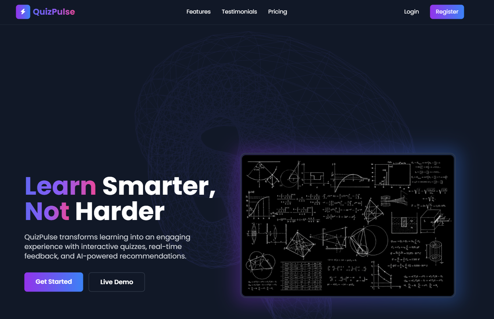

Here’s a modern, eye-catching `README.md` template for your **QuizPulse** project, complete with a "Buy Me a Coffee" link and clean formatting:

```markdown
# 🎯 QuizPulse

An interactive Laravel + React quiz platform designed for fast, responsive, and engaging assessments. Built for learners, educators, and developers who love clean UI and powerful backend logic.



---

## 🚀 Features

- 🧠 **Dynamic Quizzes**: Create, manage, and take quizzes with real-time scoring
- 🔐 **Secure Auth**: Laravel Sanctum + React for seamless login and registration
- ⚡ **Fast API**: Optimized Laravel backend with RESTful endpoints
- 🎨 **Modern UI**: Tailwind CSS + React for a sleek, responsive interface
- 📊 **Analytics Ready**: Track user performance and quiz stats
- 🌍 **SEO Optimized**: Server-side error handling and indexing improvements

---

## 🛠️ Tech Stack

| Frontend | Backend | DevOps |
|----------|---------|--------|
| React    | Laravel | Docker |
| Axios    | MySQL   | GitHub Actions |
| Tailwind CSS | Sanctum | Firebase (optional) |

---

## 📦 Installation

```bash
# Clone the repo
git clone https://github.com/rahul-sharma-alx/QuizPulse.git
cd QuizPulse

# Backend setup
composer install
cp .env.example .env
php artisan key:generate
php artisan migrate

# Frontend setup
cd frontend
npm install
npm run dev
```

---

## 📁 Project Structure

```
QuizPulse/
├── backend/ (Laravel)
│   ├── routes/
│   ├── app/
│   └── config/
├── frontend/ (React)
│   ├── src/
│   ├── public/
│   └── tailwind.config.js
```

---

## 🤝 Contributing

Pull requests are welcome! If you spot a bug or have a feature idea, feel free to open an issue.

---

## ☕ Support

If you find this project helpful or inspiring, consider [buying me a coffee](https://www.buymeacoffee.com/rahul.sharma.alx) to fuel more open-source magic.

---

## 📄 License

This project is open-source under the [MIT License](LICENSE).

---

> Built with ❤️ by Rahul Sharma. Empowering learning through code.
```

Would you like me to tailor this further for deployment instructions, CI/CD setup, or Firebase integration?