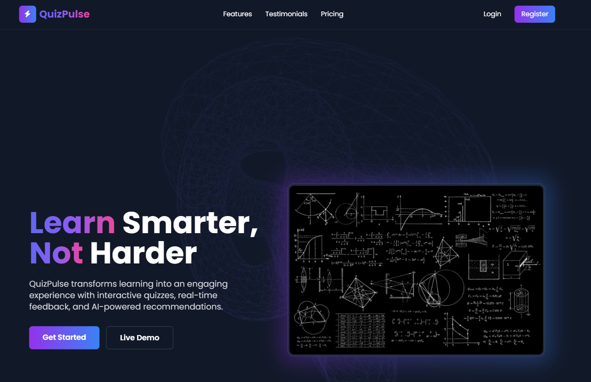

# 🎯 QuizPulse — Interactive Laravel + React Quiz Platform

**QuizPulse** is a full-stack quiz platform built with **Laravel** + **React**, delivering fast, responsive, and engaging assessments.  
Perfect for **learners**, **educators**, and **developers** who value a clean UI with a robust backend.


[](https://www.buymeacoffee.com/rahul.sharma.alx)

---

## ✨ Features at a Glance

- 🧠 **Dynamic Quizzes** — Create, manage, and attempt quizzes with real-time scoring
- 🔐 **Secure Auth** — Laravel Sanctum + React for seamless SPA login/registration
- ⚡ **Blazing Fast API** — Optimized Laravel backend with RESTful endpoints
- 🎨 **Modern UI** — Tailwind CSS + React for a sleek, responsive experience
- 📊 **Analytics Ready** — Track performance, quiz stats, and trends
- 🌍 **SEO-Friendly** — Smart server-side error handling and better indexing
- 🔄 **Real-Time Updates** — Instant scoreboard & results (WebSockets optional)

---

## 🛠 Tech Stack

| Frontend              | Backend         | DevOps / Tools       |
|-----------------------|----------------|----------------------|
| React (Vite)          | Laravel 11     | Docker               |
| Axios                 | MySQL          | GitHub Actions       |
| Tailwind CSS          | Laravel Sanctum| Firebase (optional)  |

---

## 📦 Installation & Setup

> **Prerequisites**: PHP 8.2+, Composer, Node.js 18+, MySQL, and Git installed.

```bash
# Clone the repository
git clone https://github.com/rahul-sharma-alx/QuizPulse.git
cd QuizPulse
````

### 🔹 Backend (Laravel)

```bash
cd backend
composer install
cp .env.example .env
php artisan key:generate

# Configure database in .env before running migrations
php artisan migrate
php artisan serve
```

### 🔹 Frontend (React + Vite)

```bash
cd frontend
npm install
npm run dev
```

> Default backend runs on `http://127.0.0.1:8000`
> Default frontend runs on `http://localhost:5173`

---

## 📁 Project Structure

```
QuizPulse/
├── backend/          # Laravel API
│   ├── app/
│   ├── config/
│   ├── database/
│   ├── routes/
│   └── ...
├── frontend/         # React + Tailwind CSS SPA
│   ├── src/
│   ├── public/
│   ├── tailwind.config.js
│   └── ...
└── README.md
```

---

## 🚀 Deployment

* **Docker**: Use `docker-compose up` for containerized dev/production.
* **CI/CD**: GitHub Actions config included for auto-deployment.
* **Firebase**: Optional real-time features can be enabled via Firebase.

---

## 🤝 Contributing

We welcome contributions!

1. Fork the repo
2. Create your branch: `git checkout -b feature/awesome-feature`
3. Commit changes: `git commit -m 'Add awesome feature'`
4. Push branch: `git push origin feature/awesome-feature`
5. Submit a pull request 🚀

---

## ☕ Support the Project

If you enjoy this project and want to support more open-source work:
[☕ Buy me a coffee](https://www.buymeacoffee.com/rahul.sharma.alx) — It fuels my late-night coding sessions!

---

## 📄 License

This project is licensed under the [MIT License](LICENSE).

---

> **Built with ❤️ by Rahul Sharma** — Empowering learning through clean, efficient code.

